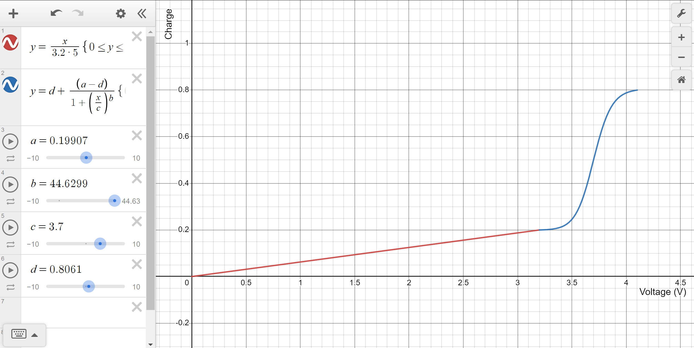
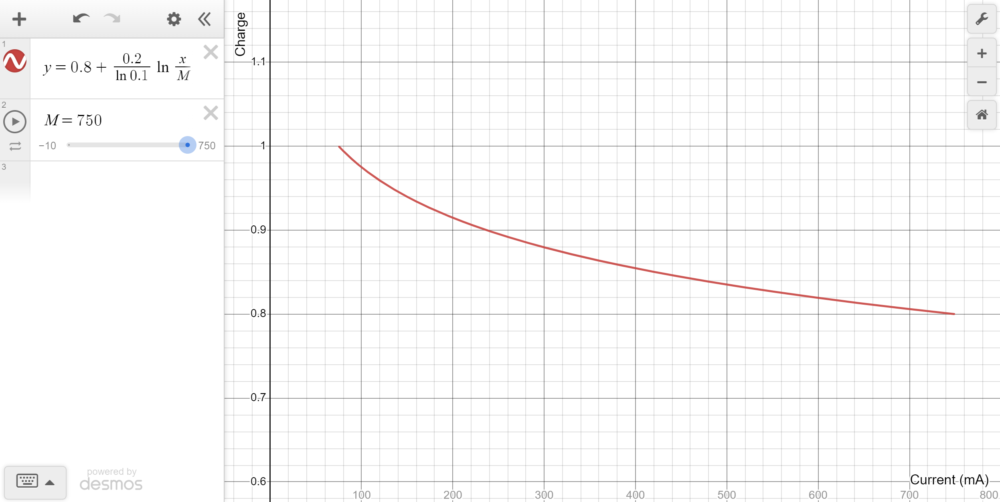

# State of Charge Estimation

## Trickle Charging
Under trickle charging, when the battery is within 0V to 3.2V (cutoff voltage), the battery charge ($C$) increases linearly with voltage of the battery ($V$) from 0% to 20%.

$C = 0.2*V/3.2$

## Constant Current Charging
Under constant current charging, the curve is fit using a 4 parameter sigmoid curve, with parameters a,b,c,d. The battery is charged from 20% to 80% in this state from 3.2V to 4.2V. 

$C = d + (d - a)/(1+(x/c)^b)$

With the following parameters:
- $a = 0.19907$
- $b = 44.6299$
- $c = 3.7$
- $d = 0.8061$

## Constant Voltage Charging
Under constant voltage charging, the battery charge ($C$) is instead a function of charging current ($I$). The graph is read from right to left as the charging current decreases from the maximum current ($M$) down to 10% of it ($0.1M$). Battery charge is 80% when current is at maximum, and considered fully charged when current is at $0.1M$.

$C = 0.8 + 0.2/ln((0.1)*(I/M))$

## Graphs
The following graph show the battery charge vs. battery voltage during the trickle charging and constant current charging phase.

This is the graph showing battery charge vs. charging current during the constant voltage charging phase. Here the maximum current ($M$) is set to 750mA. 

